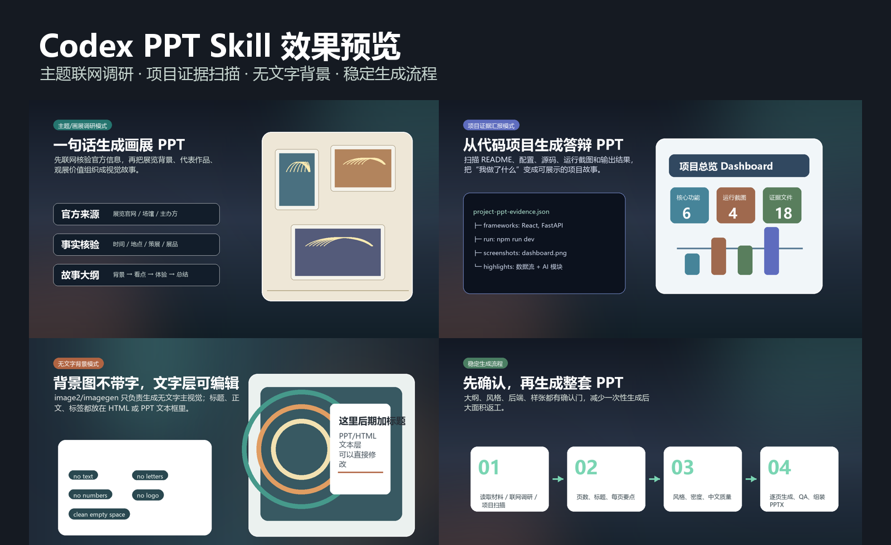
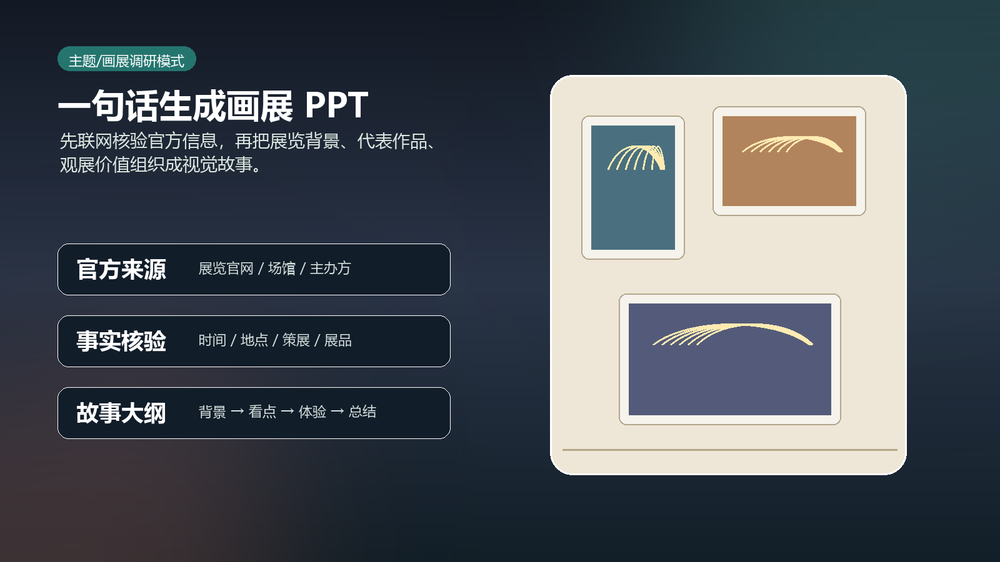
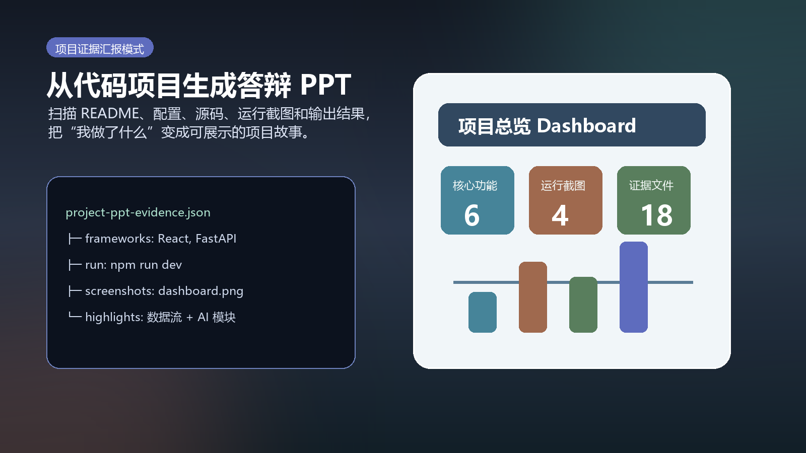
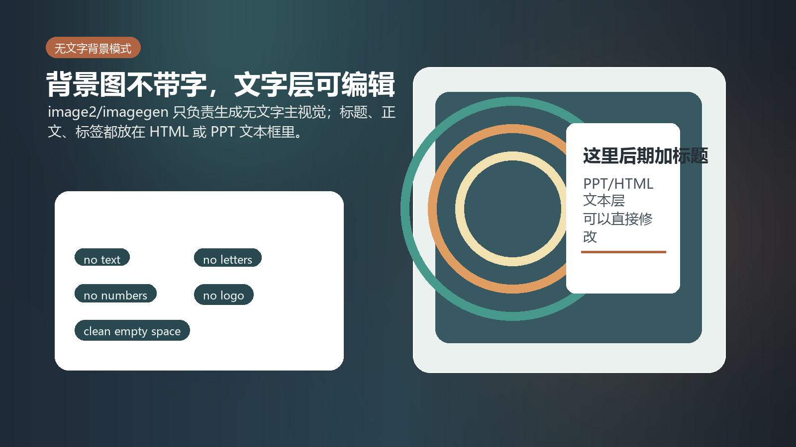
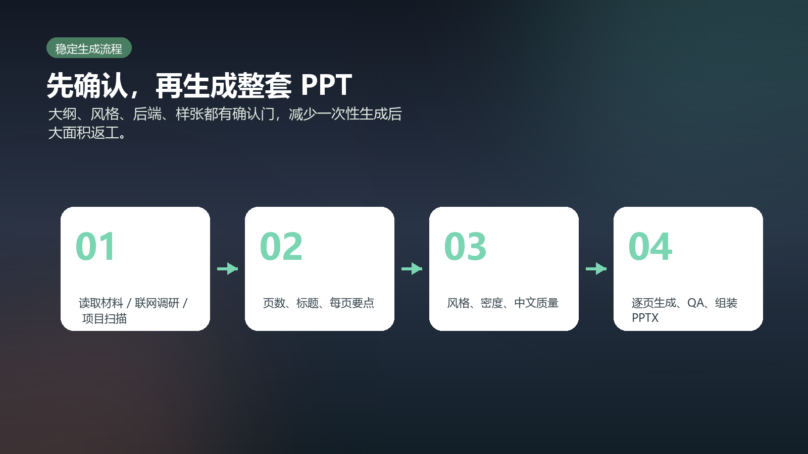

# Codex PPT Skill

A Codex skill for creating visually unified PPT/PPTX decks. It is based on `ningzimu/codex-ppt-skill` and adds local enhancements for Chinese project reports, web-researched topic decks, textless generated backgrounds, and editable HTML/PPT text layers.



## Highlights

- Topic recognition: a prompt like "create a PPT for this art exhibition" is treated as a topic/research task, not a software project.
- Web research workflow: for exhibitions, people, brands, events, places, companies, news, and trends, the skill searches official and reliable sources before writing the deck.
- Project evidence scan: for local repos, it scans README files, manifests, source files, images, likely run commands, screenshots, and generated outputs.
- Textless backgrounds: generated images can be used as no-text backgrounds while slide text remains editable in HTML or PowerPoint.
- Image-based deck workflow: confirm outline, style, backend, and one sample slide before generating the full deck.

## Showcase

| Topic / exhibition research | Project evidence report |
| --- | --- |
|  |  |

| Textless backgrounds | Stable generation workflow |
| --- | --- |
|  |  |

## Install

Ask Codex:

```text
Install this Codex skill: https://github.com/Bryce1188/codx-ppt-skill . The skill name is codex-ppt-skill.
```

Or install manually:

```bash
npx -y skills@latest add Bryce1188/codx-ppt-skill \
  --skill codex-ppt-skill \
  --agent codex \
  --global
```

## Usage

```text
Use $codex-ppt-skill to create an 8-slide Chinese PPT about a Monet exhibition. Search official and reliable sources first.
```

```text
Use $codex-ppt-skill to analyze this project, use screenshots as evidence, and create a 10-slide project defense deck.
```

```text
Use $codex-ppt-skill to generate textless slide backgrounds with image2, then keep all text editable in HTML/PPT.
```

## Credit

The core image-based PPT workflow comes from [ningzimu/codex-ppt-skill](https://github.com/ningzimu/codex-ppt-skill). This repository keeps the MIT License and adds local workflow enhancements.

## License

MIT
